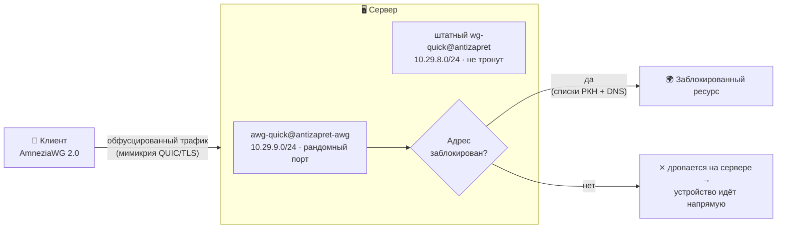

<div align="center">

# AntiZapret-AWG 2.0

**AntiZapret с полноценным AmneziaWG 2.0 — параллельным слоем поверх штатной установки.**

[](LICENSE)
[](https://github.com/amnezia-vpn/amneziawg-linux-kernel-module)
[](#требования)
[](#)
[](#telegram-бот)
[](https://github.com/GubernievS/AntiZapret-VPN)

Установка в два шага. Клиенты, статистика и обновления — из Telegram. Штатный AntiZapret не трогается.

</div>

---

## Зачем это

В оригинальном [AntiZapret-VPN](https://github.com/GubernievS/AntiZapret-VPN) поддержка AmneziaWG сводится к совместимости с существующей инфраструктурой WireGuard: соединение использует обычный WireGuard-handshake, а «AmneziaWG»-конфиги отличаются лишь junk-префиксами. Транспорт при этом остаётся распознаваемым.

Форк добавляет **полноценный AmneziaWG 2.0** с собственным транспортом — рандомизированные заголовки, обфускация транспортных пакетов, мимикрия под QUIC/TLS/DNS. Ключевое отличие от прежних версий: слой работает **параллельно** штатному AntiZapret, а не вместо него. Оригинальные WireGuard-интерфейсы, порты, `client.sh`, DNS и правила маршрутизации не изменяются ни на байт — слой поднимает свои интерфейсы на отдельных подсетях и отдельном UDP-порту. Отсюда два практических следствия: обновление AntiZapret не ломает слой, а сторонние админ-панели (например [AdminPanelAZ](https://github.com/Kirito0098/AdminPanelAZ)) продолжают работать без патчей.

## Что внутри

- **AmneziaWG 2.0** — kernel-модуль через официальный PPA (Ubuntu) или ручной репозиторий (Debian), обфускация в `[Interface]`.
- **Параллельная работа** — штатные WireGuard и OpenVPN остаются активными; слой не конфликтует с ними и с админ-панелями.
- **Раздельная маршрутизация (AntiZapret)** — в туннель уходит только заблокированное, остальное идёт напрямую. Работает и на AmneziaWG-слое, и на штатных WireGuard/OpenVPN.
- **Полный VPN** — отдельный профиль, весь трафик через сервер.
- **Настраиваемая обфускация и мимикрия** — пресеты интенсивности, шаблоны под QUIC/TLS/DNS/VoIP, выбор MTU и домена мимикрии.
- **Рандомный UDP-порт с закреплением** — выбирается при установке из свободных, исключая все зарезервированные AntiZapret; фиксируется навсегда. Задаётся и вручную.
- **Клиенты в один тап** — `.conf`, QR и `vpn://` для приложения Amnezia. Управление клиентами всех типов: AmneziaWG 2.0, стоковый WireGuard/AmneziaWG и OpenVPN.
- **Временные клиенты** с автоудалением по TTL.
- **Telegram-бот** — клиенты, статистика с гео, бэкап/восстановление и **обновления сервера** (списки, полное обновление AntiZapret, обновление слоя, перенастройка обфускации). Всё на кнопках.
- **Статистика по четырём интерфейсам** — трафик по клиентам и дням, кто онлайн, история подключений с IP/городом/провайдером, раздельно для слоя AWG 2.0 и стоковых клиентов.
- **Бэкап одной командой** — OpenVPN PKI, ключи AmneziaWG, конфиги, списки, статистика.
- **Поддержка альтернативных диапазонов** AntiZapret (`172.x`, fake-IP `198.18.x`) — подсети наследуются автоматически.

## Как это работает



Слой AmneziaWG 2.0 живёт на своих интерфейсах `antizapret-awg` / `vpn-awg`, чьи подсети получаются сдвигом третьего октета штатных на +1 (`10.29.9.x` / `10.28.9.x`). NAT, DNS и защиты штатного AntiZapret покрывают их автоматически, потому что его правила ходят по агрегатам подсетей, а раздельная маршрутизация завязана на подсеть-источник, а не на тип интерфейса. Штатные `10.29.8.x` / `10.28.8.x` при этом продолжают обслуживаться родным WireGuard. Полный VPN (`vpn-awg`) отдаёт `AllowedIPs = 0.0.0.0/0, ::/0`.

## Требования

- **Ubuntu 24.04+** — рекомендуется, протестировано.
- **Debian 12/13** — работает, best-effort: на самых свежих ядрах DKMS-модуль AmneziaWG иногда не собирается ([upstream issue](https://github.com/amnezia-vpn/amneziawg-linux-kernel-module/issues/143)). Если модуль не загрузился — смотри `dkms status` и лог сборки.
- root, установленный AntiZapret (или чистый сервер — установщик поставит базу и перезагрузит машину).
- Для бота: Python 3, `pip`/`venv` (ставятся автоматически). Зависимости: `aiogram 3`, `pexpect` — устанавливаются в изолированный venv `/opt/antizapret-awg/venv`.

## Установка

Базовый `setup.sh` перезагружает сервер, поэтому установка разбита на два шага.

**Шаг 1. Базовый AntiZapret.** Если он уже стоит — пропусти. Если нет, поставь оригинальной командой:

```bash
bash <(wget -qO- --no-hsts --inet4-only https://raw.githubusercontent.com/GubernievS/AntiZapret-VPN/main/setup.sh)
```

В анкете `setup.sh` включи WireGuard (он останется работать параллельно AmneziaWG) и OpenVPN. Сервер перезагрузится.

> Если официальный установщик у тебя падает из-за просроченного GPG-ключа OpenVPN, поставь базу через наш скрипт — он этот случай обходит: `bash <(curl -fsSL https://raw.githubusercontent.com/fageoner/Antizapret-AWG-2.0/main/install.sh) --install-base`

**Шаг 2. Слой AmneziaWG 2.0** (после перезагрузки, без ребута):

```bash
bash <(curl -fsSL https://raw.githubusercontent.com/fageoner/Antizapret-AWG-2.0/main/install.sh)
```

Выбираешь обфускацию, мимикрию, MTU, домен, порт (по умолчанию рандомный) и при желании ставишь бота. Готово.

### Флаги установщика

| Флаг | Что делает |
|---|---|
| `--install-base` | поставить базовый AntiZapret с обходом GPG-бага и перезагрузить сервер |
| `--preset high --template web` | обфускация без вопросов |
| `--awg-ports A,V` | задать порты вручную (`antizapret,vpn`), иначе рандомные из свободных |
| `--no-bot` | не спрашивать про Telegram-бота |
| `--install-bot [токен chat_id]` | доустановить бота **после** установки слоя (аргументами или интерактивно) |
| `--remove-bot` | удалить только бота, слой и клиенты остаются |
| `--bot-token X` / `--bot-admins X` | токен и chat_id для `--install-bot` без интерактива |
| `--update` | обновить код слоя, бота и раннера обновлений **без** смены обфускации, портов и клиентов |
| `--reconfigure` | переспросить настройки обфускации заново (новый профиль → клиентам нужно переимпортировать конфиги; порты не меняются) |
| `--migrate` | миграция со старых режимов `replace`/`keep` на `parallel` (ключи клиентов сохраняются, конфиги раздаются заново) |

## Управление

Через бота — или из консоли:

```bash
# AmneziaWG 2.0 (слой)
awg-client add  ivan antizapret          # split-routing → .conf + QR + vpn://
awg-client add  ivan vpn                  # полный туннель
awg-client add  guest antizapret --ttl 6h # временный (30m / 6h / 7d …)
awg-client del  ivan antizapret
awg-client list antizapret

# стоковые WireGuard/AmneziaWG и OpenVPN — штатный скрипт AntiZapret
/root/antizapret/client.sh 4 ivan         # добавить стоковый WG (оба туннеля)
/root/antizapret/client.sh 5 ivan         # удалить стоковый WG
/root/antizapret/client.sh 6              # список стоковых WG
/root/antizapret/client.sh 1 ivan 3650    # добавить OpenVPN
/root/antizapret/client.sh 2 ivan         # удалить OpenVPN
/root/antizapret/client.sh 3              # список OpenVPN

# обфускация
awg-obfuscation                           # меню с подсказками
awg-obfuscation --show                    # текущий профиль
awg-obfuscation --regenerate              # новые сигнатуры

# статистика
/opt/antizapret-awg/venv/bin/python /opt/antizapret-awg/awg_stats.py overview
# бэкап
awg-backup backup                         # → tar.gz
awg-backup restore файл.tar.gz
```

> Вызовы `client.sh` из бота сериализуются через `flock`, чтобы не конфликтовать с админ-панелью, которая пишет в те же файлы.

## Telegram-бот

Одна команда — `/start`, дальше всё кнопками.

```
🔐 AntiZapret-AWG 2.0 · vpn.example.com
├─ 👥 Клиенты
│   ├─ ➕ AmneziaWG 2.0 (AntiZapret / Полный VPN)
│   ├─ ➕ Стоковый WG      (оба туннеля разом, отдаются -am конфиги)
│   ├─ ➕ OpenVPN
│   ├─ ⏳ Временный клиент
│   └─ 📋 Список → клиент → ℹ️ Информация · 📥 Скачать · 🗑 Удалить
│                          (🌐 AWG2 split · 🔒 AWG2 полный · 🅰️ сток · 📄 OpenVPN)
├─ ℹ️ Информация      CPU / RAM / диск / аптайм, онлайн, топ-5, трафик
├─ 🔄 Обновление
│   ├─ 📋 Обновить списки АнтиЗапрета      (doall.sh, безопасно)
│   ├─ ⬆️ Полное обновление AntiZapret      (анкета кнопками · правка параметров)
│   ├─ 🧬 Обновить AWG 2.0                   (код слоя, install.sh --update)
│   └─ 🛠 Перенастроить обфускацию
├─ 🛡 Обфускация       показать / перегенерировать
├─ 💾 Бэкап
└─ ♻️ Восстановить     (принимает загруженный .tar.gz)
```

**Информация о клиенте** показывает онлайн-статус, текущий IP с городом и провайдером, историю последних подключений с датой/временем, трафик за сессию и всего — раздельно для клиентов слоя и стоковых. Клиент, который ещё ни разу не подключался, помечается отдельно, а не выдаёт ошибку.

**Полное обновление AntiZapret** заслуживает пояснения. Перед запуском бот делает *префлайт*: скачивает свежий `setup.sh`, извлекает все вопросы его анкеты и сверяет с известной картой. Дальше можно запустить обновление тремя способами: «как настроено сейчас» (ответы берутся из сохранённого файла настроек), «изменить параметры» (бот показывает текущие значения ключевых настроек — диапазоны IP, DNS, WARP, блокировка рекламы, маршрутизация — и даёт поменять любое кнопками) или «всё по умолчанию». Если апстрим добавил незнакомые вопросы, бот показывает их заранее и принимает по ним дефолт апстрима. Клиенты сохраняются (бэкап → `setup.sh` восстанавливает их сам), клиентские конфиги слоя пересобираются под свежие маршруты, слой AmneziaWG возвращается автоматически, в конце сервер перезагружается, а бот после рестарта присылает отчёт. Операция выполняется отдельным systemd-юнитом и переживает перезапуск самого бота.

> Если при установке базы выбраны альтернативные диапазоны клиентских IP (`172.x`), после полного обновления раздай split-клиентам свежие конфиги — маршруты в них могли измениться. Бот напомнит об этом в отчёте.

**Статистика OpenVPN-клиентов** читается из status-логов AntiZapret и показывает активные сессии: по какому туннелю подключён, IP, время подключения и трафик сессии. История по OpenVPN не сохраняется — только текущие подключения (в отличие от WireGuard/AmneziaWG, где ведётся полная история).

Доступ — только по whitelist `AWG_BOT_ADMINS`. Бот ставится в Шаге 2 либо доустанавливается позже через `--install-bot`.

<!-- Скриншоты: добавь свои в docs/img/ и вставь сюда, например:


-->

## Настройки обфускации

**Пресеты интенсивности:** `router` · `low` · `medium` (по умолчанию) · `high` · `paranoid`.

**Шаблоны мимикрии:** `quic` · `tls` · `web` (QUIC+TLS) · `voip` · `dns` · `mixed`. Выбирай протокол, который у твоего провайдера точно ходит.

**MTU:** авто/1320, 1420, 1280 (мобильные) или свой. **Домен мимикрии:** авто из встроенного пула доступных из РФ доменов или свой.

Профиль генерируется один раз и применяется одинаково к серверу и всем клиентам — иначе handshake не пройдёт. При смене профиля клиентские конфиги пересобираются автоматически; их нужно переимпортировать на устройствах. Перенастроить можно из бота (🔄 Обновление → 🛠 Перенастроить обфускацию) или флагом `--reconfigure`.

## Порты

Слой выбирает UDP-порт при установке рандомно из диапазона `20000–59999`, исключая занятые и все зарезервированные AntiZapret (`51443/51080` штатного WireGuard, `52443/52080` junk-редиректов, `540/580` резерва WG, `80/443/504/508` и `50080/50443` OpenVPN, плюс `1194/53/22`). Порт закрепляется в `/etc/amnezia/amneziawg/services.env` и больше не меняется — от него зависят все выданные клиентские конфиги. Задать вручную: `--awg-ports A,V`. Рандомный нестандартный порт вдобавок хуже поддаётся целевому сканированию.

## Обновление и переустановка

Состояние слоя лежит **вне** `/root/antizapret` — в `/opt/antizapret-awg` (overlay, клиенты, статистика) и `/etc/amnezia/amneziawg` (серверные ключи, профиль, порты), поэтому переживает любые операции с базой:

- **Авто-обновление AntiZapret** (по таймеру) качает только списки блокировок и пару скриптов маршрутизации — интерфейсы, обфускацию, конфиги и клиентов слоя не трогает.
- **Полное обновление / ручной `setup.sh`** делает `rm -rf /root/antizapret`. После него слой **чинится сам**: drop-in на `antizapret.service` и юнит `awg-reintegrate.service` восстанавливают сервисы слоя, симлинки, хук в `custom-up.sh` и DNS-view в `kresd.conf`. В режиме `parallel` штатный WireGuard при этом не трогается вовсе.

Обновить **код** слоя (скрипты, бот, раннер) — без смены обфускации и без пересборки клиентов:

```bash
bash <(curl -fsSL https://raw.githubusercontent.com/fageoner/Antizapret-AWG-2.0/main/install.sh) --update
```

Сменить **настройки** обфускации — новый профиль, конфиги переимпортировать на устройствах:

```bash
bash <(curl -fsSL https://raw.githubusercontent.com/fageoner/Antizapret-AWG-2.0/main/install.sh) --reconfigure
```

### Миграция со старых версий

Ранние версии форка умели работать в режимах `replace` (замена штатного WG) и `keep` (WG на фиксированных `52xxx`). Актуальная версия работает только в `parallel`. Перевод — одной командой:

```bash
bash <(curl -fsSL https://raw.githubusercontent.com/fageoner/Antizapret-AWG-2.0/main/install.sh) --migrate
```

Миграция возвращает штатный WireGuard в исходное состояние (порты, редиректы), переносит слой на интерфейсы `antizapret-awg`/`vpn-awg` и рандомный порт, сохраняя ключи клиентов. Клиентские конфиги при этом придётся раздать заново: у `keep` меняется порт `Endpoint`, у `replace` — ещё и туннельный IP.

## Диагностика

```bash
awg show                                    # интерфейсы слоя, peers, handshake, трафик
wg show                                      # штатные WireGuard-интерфейсы
systemctl status awg-quick@antizapret-awg
```

| Симптом | Причина / решение |
|---|---|
| нет интерфейса в `awg show` | `awg-quick` не поднялся → `journalctl -u awg-quick@antizapret-awg` |
| `__AWG_OBFUSCATION__` в конфиге | обфускация не применилась → `--reconfigure` |
| peer есть, но нет `latest handshake` | профиль клиента ≠ профиля сервера → переимпортируй свежий конфиг |
| handshake есть, `received` = 0 | блокировка по IP/AS провайдером — смени хостинг/IP или включи WARP |
| `awg-quick: ... already exists` | `ip link del antizapret-awg && systemctl start awg-quick@antizapret-awg` |
| бот не видит стоковый клиент | обнови слой (`--update`) — фикс имён файлов включён |
| split-клиент открывает только «прямые» сайты | после полного обновления раздай ему свежий конфиг (📥 Скачать) — маршруты обновились |
| Debian: репозиторий Amnezia «not signed» | обнови слой (`--update`) — keyring теперь `0644`, читается верификатором `_apt` |
| установлен режим `replace`/`keep` | `--migrate` |

## На чём основано

- [GubernievS/AntiZapret-VPN](https://github.com/GubernievS/AntiZapret-VPN) — база: маршрутизация, OpenVPN, DNS, списки.
- [amnezia-vpn/amneziawg](https://github.com/amnezia-vpn) — сам AmneziaWG 2.0.
- [Kirito0098/AdminPanelAZ](https://github.com/Kirito0098/AdminPanelAZ) — веб-панель, совместимая со слоем.
- [bivlked/amneziawg-installer](https://github.com/bivlked/amneziawg-installer) и [Vadim-Khristenko/AmneziaWG-Architect](https://github.com/Vadim-Khristenko/AmneziaWG-Architect) — подходы к установке AWG и генерации мимикрии.

## Лицензия

[GPLv3](LICENSE). Свободно используй, меняй и распространяй — производные тоже остаются открытыми.
