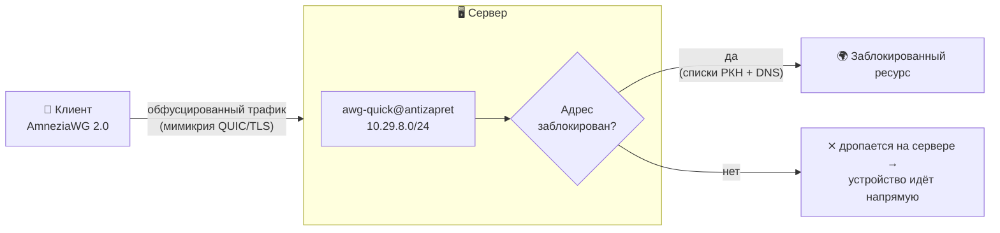

<div align="center">

# AntiZapret-AWG 2.0

**AntiZapret с AmneziaWG 2.0.**

[](LICENSE)
[](https://github.com/amnezia-vpn/amneziawg-linux-kernel-module)
[](#требования)
[](#)
[](#telegram-бот)
[](https://github.com/GubernievS/AntiZapret-VPN)

Установка в два шага. Клиенты и статистика — из Telegram. OpenVPN на месте.

</div>

---

## Зачем это

В оригинальном [AntiZapret-VPN](https://github.com/GubernievS/AntiZapret-VPN) поддержка AmneziaWG реализована через совместимость с существующей инфраструктурой WireGuard. В результате соединение использует стандартный WireGuard-handshake, а трафик остаётся совместимым с обычным протоколом.

В этом форке используется **полноценный AmneziaWG 2.0** с собственным транспортом: рандомизированные заголовки, junk-префиксы, обфускация транспортных пакетов и мимикрия под QUIC/TLS/DNS. При этом весь остальной функционал AntiZapret сохранён — OpenVPN, раздельная маршрутизация, собственный DNS, WARP и fake-IP.

## Что внутри

- **AmneziaWG 2.0** — kernel-модуль через официальный PPA, обфускация в `[Interface]`.
- **Раздельная маршрутизация (AntiZapret)** — в туннель уходит только заблокированное, остальное идёт напрямую с устройства. Работает и на AmneziaWG, и на OpenVPN.
- **Полный VPN** — отдельный профиль, весь трафик через сервер.
- **Настраиваемая обфускация и мимикрия** — пресеты интенсивности, шаблоны под QUIC/TLS/DNS/VoIP, выбор MTU и домена мимикрии при установке.
- **Клиенты в один тап** — `.conf`, QR и `vpn://`-ссылка для приложения Amnezia. OpenVPN тоже отдаётся `.ovpn`.
- **Временные клиенты** с автоудалением по TTL.
- **Telegram-бот** — управление клиентами (AmneziaWG + OpenVPN), временные клиенты, статистика с гео, бэкап/восстановление. Всё на кнопках.
- **Статистика** — трафик по клиентам и дням, кто онлайн, история подключений с IP/городом/провайдером.
- **Бэкап одной командой** — OpenVPN PKI, ключи AmneziaWG, конфиги, списки, статистика.
- **Поддержка альтернативных диапазонов** AntiZapret (`172.x`, fake-IP `198.18.x`) — подсети наследуются автоматически.

## Как это работает



Раздельная маршрутизация завязана на подсети-источники, а не на тип интерфейса, поэтому замена WireGuard → AmneziaWG ничего в ней не меняет. Полный VPN живёт в отдельной подсети (`10.28.x`) с `AllowedIPs = 0.0.0.0/0, ::/0`.

## Требования

- **Ubuntu 24.04+** — рекомендуется, на ней всё протестировано.
- **Debian 12/13** — работает, но best-effort: на самых свежих ядрах DKMS-модуль AmneziaWG иногда не собирается ([upstream issue](https://github.com/amnezia-vpn/amneziawg-linux-kernel-module/issues/143)). Если модуль не загрузился — смотри `dkms status` и логи сборки.
- root, чистый сервер (установщик базы перезагружает машину).

## Установка

Форк не ставит базу сам в одном заходе (её `setup.sh` перезагружает сервер) — поэтому два шага.

**Шаг 1. Базовый AntiZapret** (ставит зависимости, перезагружает сервер):

```bash
bash <(wget -qO- --no-hsts --inet4-only https://raw.githubusercontent.com/GubernievS/AntiZapret-VPN/main/setup.sh)
```

Ответь на вопросы `setup.sh`: WireGuard включи (он станет базой для AmneziaWG), OpenVPN оставь. Сервер перезагрузится.

**Шаг 2. Слой AmneziaWG 2.0** (после перезагрузки, без ребута):

```bash
bash <(curl -fsSL https://raw.githubusercontent.com/fageoner/Antizapret-AWG-2.0/main/install.sh)
```

Тут выбираешь обфускацию, мимикрию, MTU, домен и ставишь бота. Готово.

> Если AntiZapret уже стоит — сразу запускай Шаг 2.

### Флаги Шага 2

| Флаг | Что делает |
|---|---|
| `--preset high --template web` | обфускация без вопросов |
| `--keep-wireguard` | оставить ванильный WG активным, AmneziaWG на портах 52443/52080 |
| `--no-bot` | не спрашивать про Telegram-бота |
| `--reconfigure` | переспросить все настройки заново |

## Управление

Через бота — или из консоли:

```bash
# AmneziaWG
awg-client add  ivan antizapret          # split-routing → .conf + QR + vpn://
awg-client add  ivan vpn                  # полный туннель
awg-client add  guest antizapret --ttl 6h # временный (30m / 6h / 7d …)
awg-client del  ivan antizapret
awg-client list antizapret

# OpenVPN (штатный скрипт AntiZapret)
/root/antizapret/client.sh 1 ivan 3650    # добавить
/root/antizapret/client.sh 2 ivan         # удалить
/root/antizapret/client.sh 3              # список

# обфускация
awg-obfuscation                           # меню с подсказками
awg-obfuscation --show                     # текущий профиль
awg-obfuscation --regenerate               # новые сигнатуры

# бэкап
awg-backup backup                          # → tar.gz
awg-backup restore файл.tar.gz
```

## Telegram-бот

Одна команда — `/start`, дальше всё кнопками.

```
🔐 AntiZapret-AWG 2.0 · vpn.example.com
├─ 👥 Клиенты
│   ├─ ➕ AmneziaWG (AntiZapret / Полный VPN)
│   ├─ ➕ OpenVPN
│   ├─ ⏳ Временный клиент
│   └─ 📋 Список → клиент → ℹ️ Информация · 📥 Скачать · 🗑 Удалить
├─ ℹ️ Информация      CPU / RAM / диск / аптайм, онлайн, топ-5, трафик
├─ 🛡 Обфускация       показать / перегенерировать
├─ 💾 Бэкап
└─ ♻️ Восстановить     (принимает загруженный .tar.gz)
```

**Информация о клиенте** не сбрасывается и показывает: онлайн-статус, текущий IP с городом и провайдером, историю последних подключений с точной датой/временем, трафик за сессию и всего.

Доступ — только по whitelist `AWG_BOT_ADMINS`. Установка бота встроена в Шаг 2 (спросит токен и chat_id).

<!-- Скриншоты: добавь свои в docs/img/ и вставь сюда, например:


-->

## Настройки обфускации

**Пресеты интенсивности:** `router` · `low` · `medium` (по умолчанию) · `high` · `paranoid`.

**Шаблоны мимикрии:** `quic` · `tls` · `web` (QUIC+TLS) · `voip` · `dns` · `mixed`. Выбирай тот протокол, который у твоего провайдера точно ходит.

**MTU:** авто/1320, 1420, 1280 (мобильные) или свой. **Домен мимикрии:** авто из встроенного пула доступных из РФ доменов или свой.

Профиль генерируется один раз и применяется одинаково к серверу и всем клиентам — иначе handshake не пройдёт. При смене профиля клиентские конфиги пересобираются автоматически; их нужно переимпортировать на устройствах.

## Обновление и переустановка

```bash
bash <(curl -fsSL https://raw.githubusercontent.com/fageoner/Antizapret-AWG-2.0/main/install.sh) --reconfigure
```

Существующие серверные ключи и клиенты сохраняются, обфускация синхронизируется.

## Диагностика

```bash
awg show                                    # интерфейсы, peers, handshake, трафик
systemctl status awg-quick@antizapret
```

| Симптом | Причина / решение |
|---|---|
| нет интерфейса в `awg show` | `awg-quick` не поднялся → `journalctl -u awg-quick@antizapret` |
| `__AWG_OBFUSCATION__` в конфиге | обфускация не применилась → переустанови Шаг 2 |
| peer есть, но нет `latest handshake` | профиль клиента ≠ профиля сервера → переимпортируй свежий конфиг |
| handshake есть, `received` = 0 | блокировка по IP/AS провайдером — смени хостинг/IP или включи WARP |
| `awg-quick: 'vpn' already exists` | `ip link del vpn && systemctl start awg-quick@vpn` |

## На чём основано

- [GubernievS/AntiZapret-VPN](https://github.com/GubernievS/AntiZapret-VPN) — база: маршрутизация, OpenVPN, DNS, списки.
- [amnezia-vpn/amneziawg](https://github.com/amnezia-vpn) — сам AmneziaWG 2.0.
- [bivlked/amneziawg-installer](https://github.com/bivlked/amneziawg-installer) и [Vadim-Khristenko/AmneziaWG-Architect](https://github.com/Vadim-Khristenko/AmneziaWG-Architect) — подходы к установке AWG и генерации мимикрии.

## Лицензия

[GPLv3](LICENSE). Свободно используй, меняй и распространяй — производные тоже остаются открытыми.
